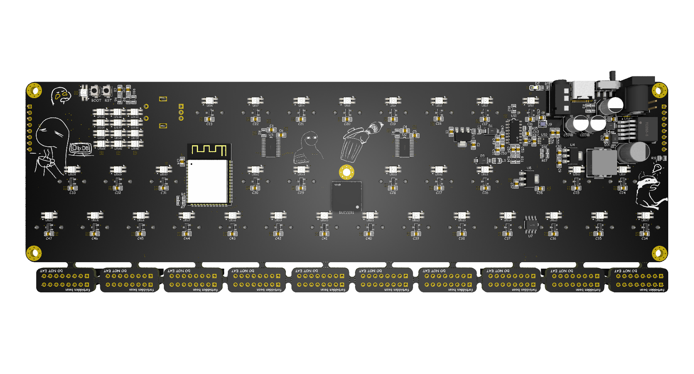
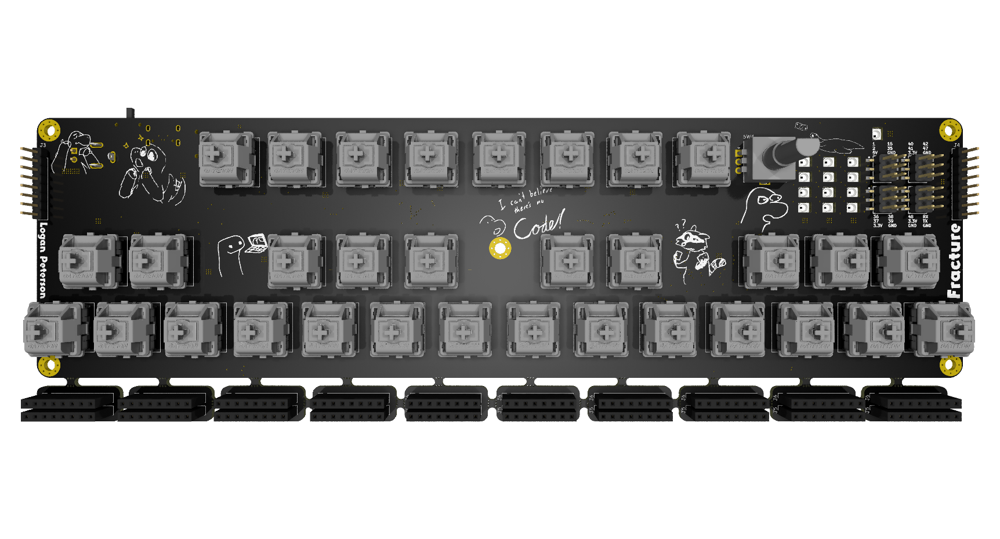

# Fracture - The Infinitely Chainable MIDI Keyboard

### A modular, glowing wall of keys with its own brain, synth, and buzzer per board.

---

## Renders  
*Visuals because everyone loves eye candy.*

---

## What is this?

It's an infinitely expandable MIDI keyboard system built around an ESP32-S3, designed so each board is a fully-featured synth module. When you connect a bunch together, they behave like one giant, continuous instrument.

Each board gives you:
- **2 octaves of hall-effect keys** (24 main keys)
- **8 “function” keys** for extra tricks
- **Onboard polyphonic I2S audio output**
- **A polyphonic buzzer synth per board**
- **45 addressable RGB LEDs** for underglow + status
- **RS-485 chaining** so all boards share note events
- **USB MIDI**, so any board plugged into your computer speaks for the whole keyboard

One board is fun.
Four boards gives you a full velocity sensing piano.

---

## Features

### Infinitely Chainable Boards

- Each board has:
  - **24 main keys** (2 octaves)
  - **8 extra keys** (function / mode keys)
- Boards discover each other physically via:
  - **RS-485 bus** (SP3485)
  - **Left/right neighbor sense pins**  
- During startup:
  - Boards auto-assign a board index
  - Recalculate their MIDI base note based on position
- Hot-plug-ish friendly:
  - Board `0` pings the others
  - If someone disappears or a new board shows up:
    - The network will auto-remap
    - Everything reconfigures to the new layout

---

### Hall-Effect Velocity Sensing

No mushy rubber domes here.

- Keys are read via dual 74HC4067 analog multiplexers
- Each key is measured against a calibrated baseline from startup
- Velocity is computed using:
  - dt signal from the baseline
  - Time between “start of motion” and “fully pressed”

It’s all done in firmware - no external velocity hardware, just some math and a lot of analog readings.

### Onboard Polyphonic Synth (I2S DAC)

Each board is a tiny synth:

- **ES9023P I2S DAC**
  - Driven at 44.1 kHz, stereo
- Up to 8 simultaneous voices
- Simple *sine-wave polysynth*:
  - One voice per active note
  - Velocity mapped into amplitude
- Muting:
  - Hardware mute pin controlled by the ESP32-S3

You don’t *need* a computer to hear anything, the keyboard can sing on its own.

### Polyphonic Buzzer Per Board

Because one audio path wasn’t enough.

- **Timer-driven buzzer synth**:
  - Runs at 20 kHz sample rate
  - Up to 12 buzzer voices per board
- Each key can spawn its own square-wave tone on the buzzer
- Fully independent from the I2S audio path
- Toggling:
  - Buzzer can be turned **on/off in hardware** via extra keys or the encoder button
- Used for:
  - Startup jingle
  - Any Feedback sounds
  - Mild harassment of anyone nearby

### RGB Overload (Key Underglow + Debug UI)

45 WS2812 LEDs per board:

- **32 key LEDs**:
  - One LED per key (24 main + 8 extra)
- **Ripple effect**:
  - Every note triggers a *“splash in the pond”* ripple
  - Ripple spreads based on *MIDI note distances*, not physical LED position
  - Works **across all boards**, because note events are shared over RS-485
- **Status LEDs**:
  - LEDs *33–36* encode the board index in binary
  - LED *37* = buzzer enabled
  - LED *38* = audio enabled
  - LED *39* = left neighbor detected
  - LEDs *40-44* reserved / free
- **Top-left status LED (LED 45)**:
  - Yellow while the network is remapping
  - Soft green when the RS-485 network is happy

Basically: the keyboard tells you how it feels in RGB.

### USB MIDI for the Entire Chain

Any board plugged into USB exposes MIDI for **all** boards:

- Incoming note events:
  - Local keypresses
  - RS-485 broadcast notes from other boards
- All of that is forwarded to:
  - USB MIDI OUT
  - Onboard I2S synth
  - Local buzzer (if enabled)

So you can:
- Plug in literally any board in the chain
- Open your DAW / synth
- Play the entire keyboard from that one cable

### Extra Keys & Modes

Those 8 “not piano” keys do the fun stuff:

- **Toggle buzzer** on/off
- **Toggle I2S audio** on/off
- Force a **full network remap** (RS-485 rediscovery)
- **Octave up / down** the local board’s note range

They also get the same RGB treatment and can participate in the visual chaos.

### Rotary Encoder

Because knobs are scientifically proven to make things better.

- **Incremental encoder + push switch**
- Current firmware:
  - Tracks a *0–127 “value”* (for mapping to whatever)
  - Button press toggles buzzer mode
- Future ideas:
  - Volume
  - Filter cutoff / synth parameters
  - Patch switching
  - Global “chaos” amount (obviously)

---

## How It All Works (High-Level)

1. **Power on**
   - ESP32-S3 boots
   - LEDs do a little flash
   - Buzzer plays a startup jingle
   - Keys are calibrated to their analog baselines

2. **Board discovery**
   - Each board checks its left neighbor input
   - If there’s no left neighbor board 0 has been found
   - Board 0:
     - Announces itself on RS-485
     - Pulses a “neighbor” line down the chain
   - Each downstream board:
     - Sees that pulse
     - Picks the next free board index
     - Announces itself back over RS-485

3. **Normal operation**
   - Keys continuously scanned via analog muxes
   - Each note event fans out to:
     - **Local LEDs** (key + ripple)
     - **Local buzzer** (if enabled)
     - **Local I2S synth**
     - **RS-485 broadcast**
     - **USB MIDI**

4. **Network health**
   - Board 0 sends periodic pings over RS-485
   - Other boards reply with an ID + sequence
   - Missing replies -> network marked unhealthy
   - Board 0 triggers a remap request -> everyone rediscover
   - Top-left LED shows remap / healthy / sad states

Result: a self-organizing, glowing MIDI centipede.

---

## BOM

All the silicon, magnetics, and glowsticks live **[here](/BOM.csv)**.

**Main characters:**
- **MCU:** ESP32-S3
- **Analog Muxes:** 2× 74HC4067 (16-channel each)
- **Hall-Effect Key Sensors:** 24 main + 8 extra
- **LEDs:** 45× SK6812 MINI E LEDs (key underglow + status)
- **Audio DAC:** ES9023P (I2S stereo)
- **Buzzer:** Onboard piezo per board (timer-driven polyphonic)
- **RS-485 Transceiver:** SP3485
- **Rotary Encoder:** EC11-style with pushbutton

(See `BOM.csv` / `BOM.md` for full part numbers and sourcing.)

---

## Why?

Because:

- Regular MIDI controllers are boring.
- Off-the-shelf keyboards don’t re-map themselves and you usually cant chain them together
- RGB is free (emotionally).
- And having:
  - Onboard synth
  - Onboard buzzer
  - Infinite expansion
  - Self-aware status LEDs

…all on a single system felt too fun not to build.

Fracture exists to be:
- Modular  
- Mildly smart  
- And just slightly over-engineered.

I honestly thought this would be an easier project, but feature creep got the best of me...

---

## Contribute

Ideas, improvements, and constructive roasting welcome.

- Open an **issue**
- Submit a **PR**
- Suggest cursed new expansion ideas
- Or figure out what else that encoder should do

---

## Disclaimer

This project is open-source and powered by *vibes and a sprinkle of C++*.

If you:
- Somehow mess up the RS-485 bus 
- Drive speakers directly off something that shouldn’t  
- Misconfigure power and let the smoke out  

That’s on you.

Be careful, be smart, and enjoy building a keyboard that expands with your musical ability.

