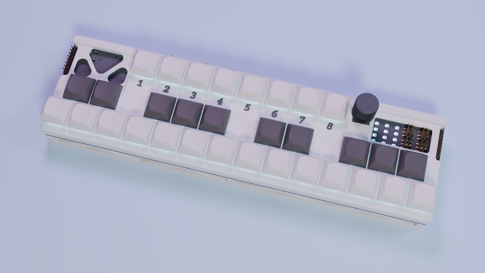
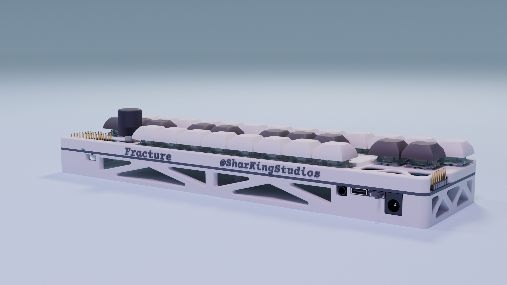
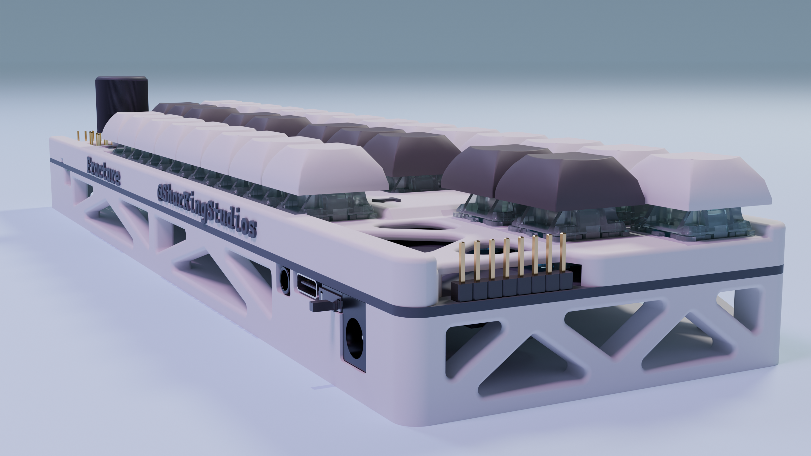
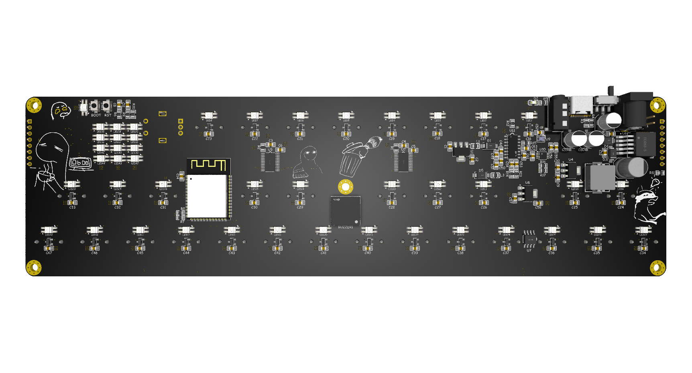
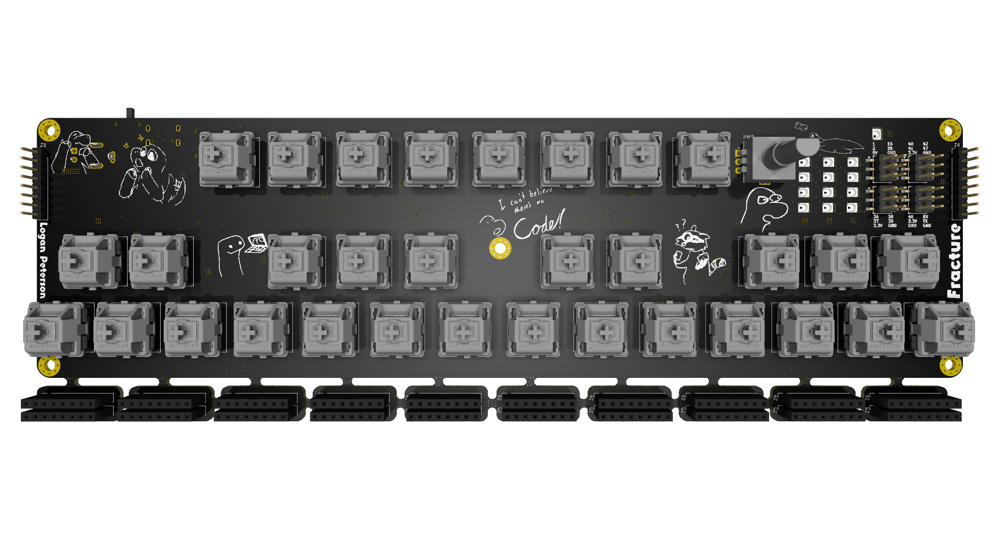
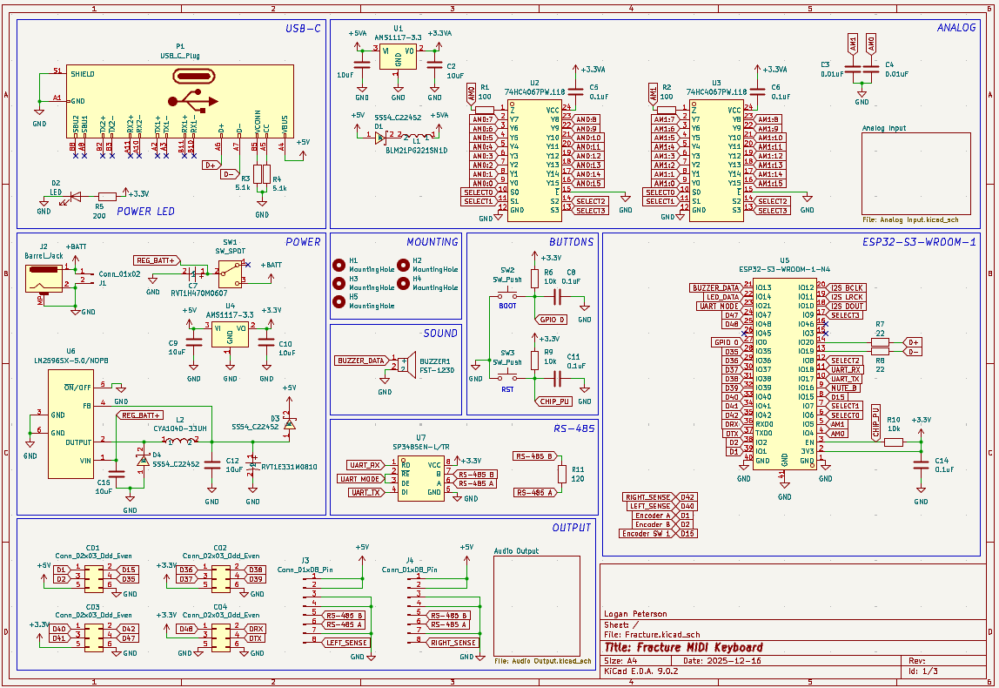
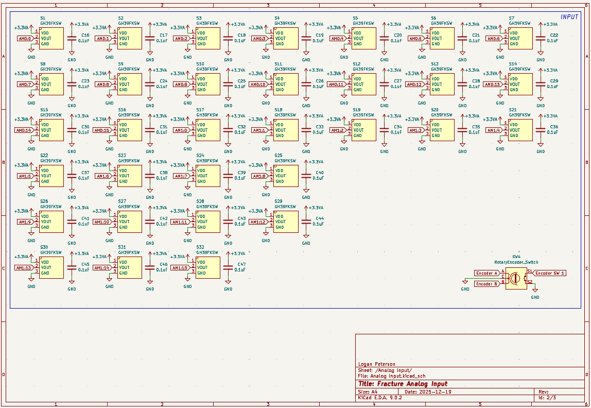
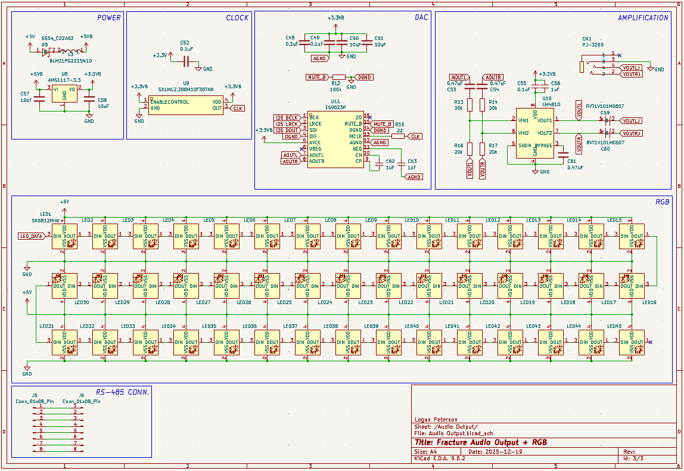
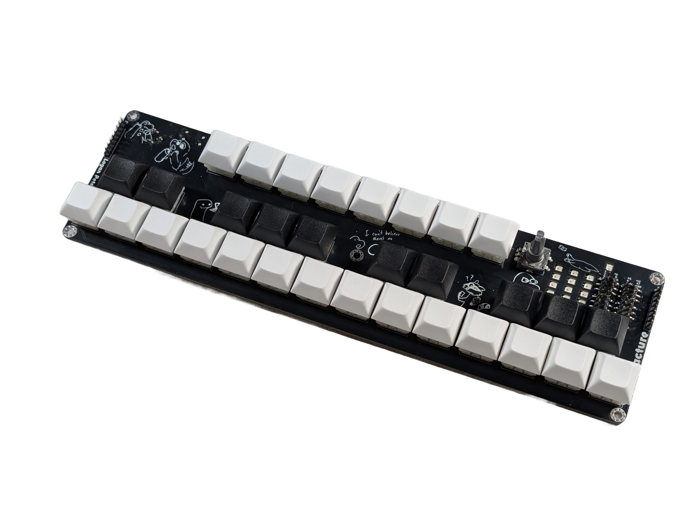

# Fracture - The Infinitely Chainable MIDI Keyboard

### A modular, glowing wall of keys with its own brain, synth, and buzzer per board.

---

## Renders  
*Visuals because everyone loves eye candy.*

---

## What is this?

It's an infinitely expandable MIDI keyboard system built around an ESP32-S3, designed so each board is a fully-featured synth module. When you connect a bunch together, they behave like one giant, continuous instrument.
Each board gives you **2 octaves** of hall-effect keys (24 main keys), plus 8 “function” keys for extra tricks. It also has **onboard I2S audio output**, a buzzer synth per board, and 45 addressable RGB LEDs for underglow + status.
Boards talk to each other over **RS-485 chaining** so note events get shared, and it also does **USB MIDI**, meaning any board plugged into your computer speaks for the whole keyboard.

One board is fun.  
Four boards gives you a full velocity sensing piano.

---

## Features

### Infinitely Chainable Boards

Each board is its own little 2-octave chunk: **24 main keys** and **8 extra keys** for function/mode stuff. The boards discover each other physically using an **RS-485 bus** (SP3485) and **left/right neighbor sense pins**, so you can keep chaining them together.

---

### Hall-Effect Velocity Sensing

No mushy rubber domes here. Keys are read using dual **74HC4067 analog multiplexers**, and velocity is computed using the time between “start of motion” and “fully pressed”.

It’s all done in firmware - no external velocity hardware, just some math and a lot of analog readings.

---

### Onboard Polyphonic Synth (I2S DAC)

Each board is a tiny synth. It uses an **ES9023P I2S DAC** driven at **44.1 kHz, stereo**, and supports up to *8 simultaneous voices*.

You don’t *need* a computer to hear anything, the keyboard can sing on its own.

---

### Polyphonic Buzzer Per Board

Because one audio path wasn’t enough. Each board also has a **timer-driven buzzer synth** that runs at a **20 kHz sample rate**. It’s used for a startup jingle, any feedback sounds, and mild harassment of anyone nearby.

---

### RGB Overlay (Key Underglow + Debug UI)

Each board has **45 WS2812 LEDs** and they’re not just there to look pretty (but they do). Every note triggers a *“splash in the pond”* ripple, and the ripple spreads based on *MIDI note distances*, not physical LED position. Since note events are shared over RS-485, the ripple effect works *across all boards*.

Basically: the keyboard tells you how it feels in RGB.

---

### USB MIDI for the Entire Chain

Any board plugged into USB exposes MIDI for **all** boards. So you can plug in literally any board in the chain, open your DAW / synth, and play the entire keyboard from that one cable.

---

### Rotary Encoder

Because knobs are scientifically proven to make things better.

---

## BOM

All the silicon, magnetics, and glowsticks live **[here](/BOM.csv)**.

---

## Why?

Because regular MIDI controllers are boring. Off-the-shelf keyboards don’t re-map themselves and you usually cant chain them together.

Fracture exists to be modular, mildly smart, and just slightly over-engineered.

I honestly thought this would be an easier project, but feature creep got the best of me...

---

## Contribute

Ideas, improvements, and constructive roasting welcome.

- Open an **issue**
- Submit a **PR**
- Or suggest cursed new expansion ideas

---

## Disclaimer

This project is open-source and powered by *vibes and a sprinkle of C++*.

If you:
- Somehow mess up the RS-485 bus 
- Drive speakers directly off something that shouldn’t  
- Misconfigure power and let the smoke out  

That’s on you.

Be careful, be smart, and enjoy building a keyboard that expands with your musical ability.

